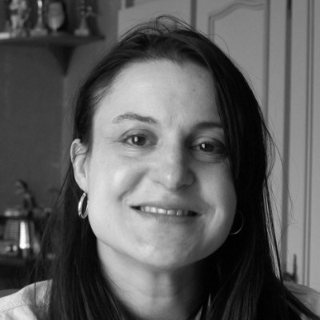

## New turn

In 2021, like many others, I faced unexpected changes due to the global pandemic. After being laid off from my role, I decided to take a leap into freelancing—a move I had always considered but never fully committed to. With my experience in full-stack development, I was ready to explore new opportunities on my own terms.

## Freelancing

Freelancing allowed me to dive into a variety of projects, not just building full-stack solutions but also offering end-user support. This combination of development and client-facing work gave me a deeper insight into how software impacts users directly, refining my approach to development.

### perfect transition

While the transition wasn’t always smooth, the freedom to manage my own time and the diversity of projects I encountered has been incredibly rewarding. Freelancing has helped me grow both as a developer and as a professional, opening up new possibilities I hadn’t considered before.
