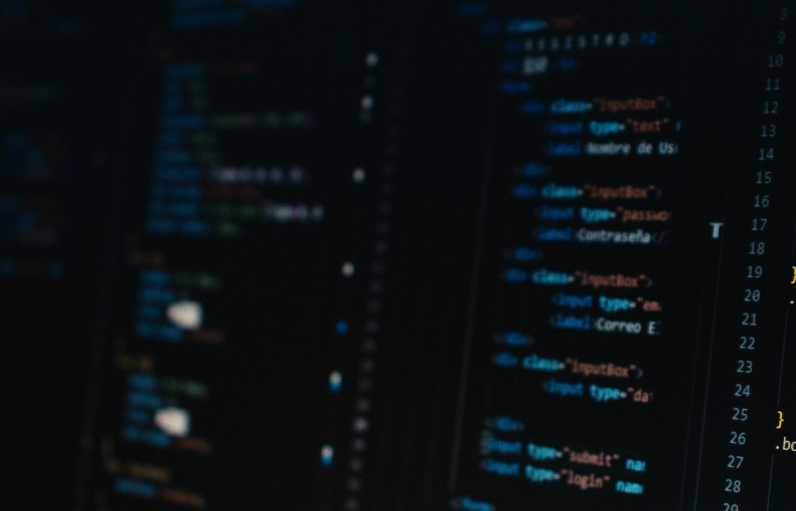

## Introduction

Welcome to my first-ever blog post! I'm excited to finally take the plunge and
start sharing my thoughts, experiences, and ideas with the world. I've been
following blogs for years and have always been inspired by the amazing content
and community that exists in the blogosphere. Now, it's my turn to join the
conversation and contribute my own voice to the mix.

In this post, I'll be introducing myself, sharing my motivation for starting a
blog, and giving you a preview of the types of content you can expect to see
from me in the future. Whether you're a seasoned blogger or a first-time reader,
I hope you'll find this post to be a fun and engaging introduction to who I am
and what I have to offer. So, without further ado, let's get started!

## About Me

Hey there, I'm Aude Falco, a web developer and Javascript enthusiast from
Paris, France. Over the years, I've gained experience in a wide range of web technologies, including HTML, CSS,
and JavaScript, and I'm always looking for new and innovative ways to create
amazing web experiences.

### Why I started this blog

I started this blog as a way to share my knowledge and experiences with other
developers, enthusiasts, and beginners alike. I believe that the best way to
learn is by doing, and my hope is to inspire others to dive in and start
building amazing things on the web.

### What I like doing in my spare time

When I'm not coding or writing about web development, you can find me playing music, sometimes composing. Thanks for checking out my
blog, and I can't wait to share more with you!
